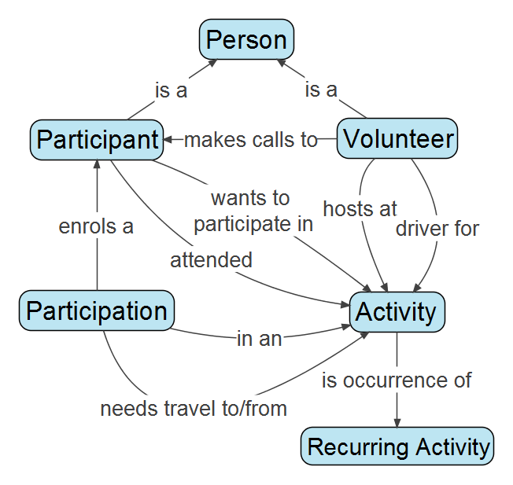

== Introduction 

This document is a user-guide for the Lifeline Tasmania Chats Application.

The Chats Application (App) has been developed to administer the Lifeline Tasmania 'Chats Program' by <<SCDS,Stephen Cameron Data Services>> in collaboration with Lifeline Tasmania staff. 

It is open-source software developed in Java and based on the free and open-source http://isis.apache.org[Apache Isis] framework. The source code of the Chats App is available in http://github.org[GitHub].

Apache Isis has some that key features that are worth stating up front. An App based on Apache Isis will assume that the App user is a problem solver rather than a recipe follower.

Apache Isis also follows a design approach known as Domain-Driven, meaning that the language of the domain is reflected in the App. So, if you are familiar with the domain you should be able to solve problems quickly and intuitively in the Chats App easily.

In the Conceptual Diagram below a few key concepts and associations of the domain are shown.

== Key Concepts

A <<Person, Person>> entity is simply what its name indicates (let's start off simple!), it holds the basic details of a person such as names, date-of-birth and contact details. The Chats App uses the combination of each person's first-name, last-name (family-name) and date-of-birth to determine unique identity.

A <<Participant, Participant>> is a Person who wants to participate in one or more Activities. Think of it as a Person taking on a role ( the system has been developed so that each Person is accessed via their roles).

A <<Volunteer, Volunteer>> is a Person who can be an host at, or be a driver for, an Activity, and/or make Chats Social Calls to Participants. The same role comment applies for a Volunteer as for a Participant, indeed the same Person can be both a Volunteer and a Participant.

An <<Activity, Activity>> is event that Participant can request to participate in, creation of a Participation enrols the Participant in that Activity (or sequence of recurring Activities). 

A <<Participation, Participation>> is in essence an enrolment of a Particpant in a specific Activity event. It also the entity that can hold data required for scheduling of travel arrangements for that Participant to get to and from an from Activity.

A <<RecurringActivity, Recurring Activity>> is a virtual or model Activity from which multiple real Activity events can be scheduled into the future.

== Menu Structure

* Activities
** <<Activities__createRecurringActivity, Create Recurring Activity>>
** <<Activities__listAllRecurringActivities, List All Recurring Activities>>
** <<Activities__findRecurringActivityByName, Find Recurring Activity By Name>>
** <<Activities__createOneOffActivity, Create One Off Activity>>
** <<Activities__findActivityByName, Find Activity By Name>>
** <<Activities__listAllFutureActivities, List All Future Activities>>
** <<Activities__listAllPastActivities, List All Past Activities>>
* Participants
** <<Participants__listActive, List Active>>
** <<Participants__listInactive, List InActive>>
** <<Participants__listExited, List Exited>>
** <<Participants__listToExit, List To_Exit>>
** <<Participants__findBySurname, Find By Surname>>
** <<Participants__create, Create>>
* Volunteers
** <<Volunteers__listActive, List Active>>
** <<Volunteers__listInactive, List InActive>>
** <<Volunteers__listExited, List Exited>>
** <<Volunteers__listToExit, List To_Exit>>
** <<Volunteers__findBySurname, Find By Surname>>
** <<Volunteers__create, Create>>
* Attendances
** <<Attendances__createAttendanceList, Create Attendance List>>
** <<Attendances__listAttendanceLists, List Attendance Lists>>
* Calls
** <<CallSchedules__listDailyCallSchedulesForActiveVolunteer, List Daily Call Schedules For Active Volunteer>>
** <<CallSchedules__listDailyCallSchedulesForVolunteer, List Daily Call Schedules For Volunteer>>
** <<CallSchedules__listCallsToActiveParticipant, list Calls To Active Participant>>
** <<CallSchedules__listCallsToParticipant, list Calls To Participant>>
** <<CallSchedules__listCallsByVolunteer, List Calls By Volunteer>>
** <<CallSchedules__listCallsToParticipantByVolunteer, list Calls To Participant By Volunteer>>

////
* Reports
** <<ParticipantActivity__participantActivityByMonth,Participant Activity By Month>>
** <<InactiveParticipantsByMonthsInactive__findMostInactiveParticipants, Find Most Inactive Participants>>
** <<InactiveParticipantsByMonthsInactive__findParticipantActivity, Find Participant Activity>>
** <<VolunteeredTimeReports__volunteeredTimeByMonth, Volunteered Time By Month>>
** <<VolunteeredTimeReports__volunteeredTimeForActivitiesByMonth, Volunteered Time For Activities By Month>>
** <<VolunteeredTimeReports__volunteeredTimeForActivitiesByVolunteerAndMonth, Volunteered Time For Activities By Volunteer And Month>>
** <<VolunteeredTimeReports__volunteeredTimeForCallsByMonth, Volunteered Time For Calls By Month>>
** <<VolunteeredTimeReports__volunteeredTimeForCallsByVolunteerAndMonth, Volunteered Time For Calls By Volunteer And Month>>
** <<MailMergeInputData__allMailMergeData, All Mail Merge Data>>
** <<MailMergeInputData__allActiveParticipantsMailMergeData, All Active Participants Mail Merge Data>>
** <<MailMergeInputData__allActiveVolunteersMailMergeData, All Active Volunteers Mail Merge Data>>
* Notes

////

== Menu Item Descriptions

include::au.com.scds.chats.dom.module.activity.Activities.adoc[]
include::au.com.scds.chats.dom.module.participant.Participants.adoc[]
include::au.com.scds.chats.dom.module.volunteer.Volunteers.adoc[]
include::au.com.scds.chats.dom.module.attendance.AttendanceLists.adoc[]
include::au.com.scds.chats.dom.module.call.ScheduledCalls.adoc[]

